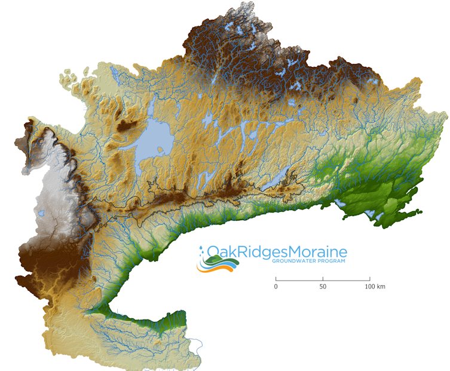
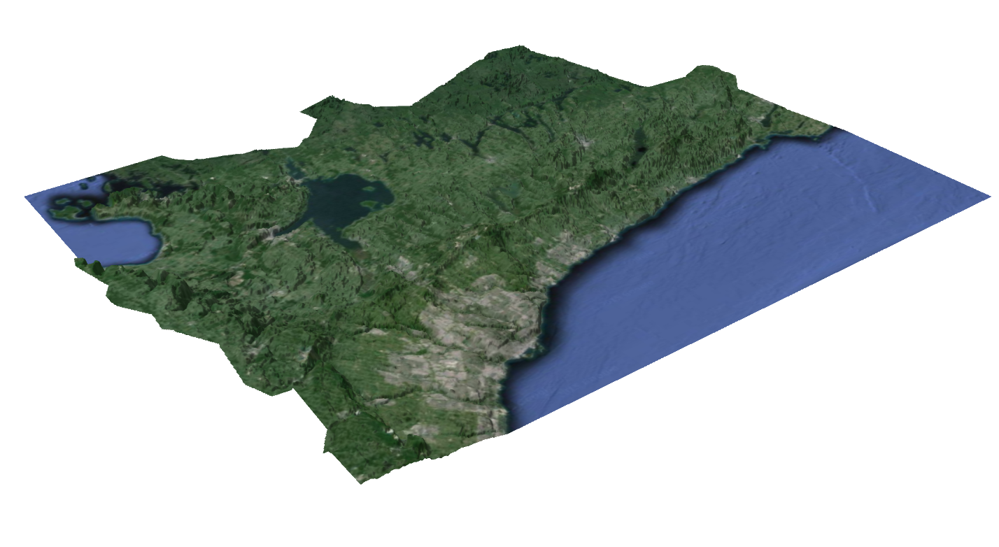

This is the home page for the documentation we have published in the form of ["GitHub Pages"](https://pages.github.com/). 

> [**Our Homepage: oakridgeswater.ca**](https://www.oakridgeswater.ca/)

> [**View us on GitHub**](https://github.com/OWRC)

> [**Partners' mapping portal**](https://partners.oakridgeswater.ca/Maps)

 

<!-- ## By category

- [Program Background](https://owrc.github.io/background.html)
- [Publications & Reports](https://owrc.github.io/publications.html)
- [Products and Interpolation ](https://owrc.github.io/products.html)
- [Support](https://owrc.github.io/support.html) -->

## Data Sources and Management

- [**Metadata**](https://owrc.github.io/metadata/content/toc.html) (for ORMGP-produced layers)
- [External Data Sources](https://owrc.github.io/interpolants/sources/) regularly imported into our data warehouse
- [**Database** Manual](https://owrc.github.io/database-manual/Contents/TOC.html)
- [Geologic Layer Development](https://owrc.github.io/GeoLayers/)
- [Interpolation of Surfaces](/interpolants/interpolation)
- [Data Management](/interpolants/datamanagement)
- [Data Warehousing](/interpolants/#data-warehousing-how-we-store-our-data)
- [Data Sources](/interpolants/#data-sources-where-we-get-our-data)
- [Web Applications](/interpolants/#web-applications-how-we-disseminate-our-data) and [Tools](/interpolants/tools)
- [Technologies](/interpolants/#technologies-the-tools-we-use)
- [Data **Products** and Spatial **Interpolation**](https://owrc.github.io/interpolants/):
  - [Open Data and Products](/interpolants/#open-data-products-the-data-we-create)
  - [Water Balance Modelling](https://owrc.github.io/interpolants/#regional-water-budget-long-term-and-continuous)
  - [Overland Drainage](https://owrc.github.io/interpolants/#elevation-drainage-and-topology)
  - [Climate Data Source Reference](https://owrc.github.io/interpolants/sources/reference.html)

## ORMGP Programs and Services

- [Monitoring](https://owrc.github.io/monitoring/)
- [Web Mapping Themes](https://owrc.github.io/webmapping/)
- Near Real-time [**Climate Data Service**](https://owrc.github.io/interpolants/sources/climate-data-service.html)
- [Numerical Model Custodianship Program](https://owrc.github.io/snapshots/md/numerical-model-custodianship-program.html)
- [Database **Snapshots**](https://owrc.github.io/snapshots/)
  - [Municipal well water quality status](https://owrc.github.io/snapshots/ctc/MunicipalWellWaterQualityStatus.html)
  - [Groundwater variability](https://owrc.github.io/snapshots/md/gwvar.html)
  - [Hydrograph separation](https://owrc.github.io/snapshots/md/baseflow-piechart.html)
- [**Clip 'n Ship**](https://owrc.github.io/interpolants/sources/clipnship.html)

## Help and Resources

- [General/Educational **Information**](https://owrc.github.io/info/)
  - [Evaporation](https://owrc.github.io/info/evaporation/)
  - [Geothermal modelling](https://owrc.github.io/info/geothermal/)
  - [Hydrograph separation](https://owrc.github.io/info/hydrographseparation/)
  - [hydrograph disaggregation](https://owrc.github.io/info/hydrographdisaggregation/)
  - [Streamflow recession coefficient](https://owrc.github.io/info/recessioncoefficient/)
  - [Multiphase flow through porous media](https://owrc.github.io/info/pmflow/)
  - [Shallow water overland flow](https://owrc.github.io/info/lia/)
  - [Solar Radiation Transmittance](https://owrc.github.io/info/solarradiation/)
- [sHydrograph (map) help](https://owrc.github.io/HydrographExplorerHelp/)
- [sHydrology--R-Shiny Applications Manual](https://owrc.github.io/shinyapps-manual/)
- [ORMGP spatial data (.geojson)](https://github.com/OWRC/geojson)
- [Glossary](/interpolants/glossary.html)

## Shiny Apps

- [**sHydrology** (time series analysis map)](https://owrc.shinyapps.io/shydrologymap/)
- [sHySpatialAnalysis (current state of the system)](https://owrc.shinyapps.io/sHySpatialAnalysis/)
- [sHyMetDS (real-time climate data service)](https://owrc.shinyapps.io/sHyMetDS/?lat=44.138&lng=-79.113)
- [ORMGP subwatershed topology](https://owrc.shinyapps.io/sws23/)
- [automated particle tracking](https://owrc.shinyapps.io/ptrack/) *works best with Google Chrome browser--also available in partners' portal*
- [automated baseflow pickup calculation](https://owrc.shinyapps.io/pickup/) *beta version, to be included in our partners' portal*

# Help and Resources

## Logos

### PNG

#### Large

#### Small

#### No text

<!--  -->

### SVG

[*more..*](https://github.com/OWRC/logos)

 

## Images

 

## Markdown "Cheatsheets"
- [GitHub Wiki](https://github.com/adam-p/markdown-here/wiki/Markdown-Cheatsheet)
- [How to write math equations like](http://tug.ctan.org/info/undergradmath/undergradmath.pdf) $S_s\frac{\partial h}{\partial h} = K\nabla^2 h - G$

# Sitemap

<!-- built with: snapshots-private\sitemap -->
<iframe src="https://golang.oakridgeswater.ca/pages/sitemapD3.html" width="100%" height="800" scrolling="no" allowfullscreen></iframe>

